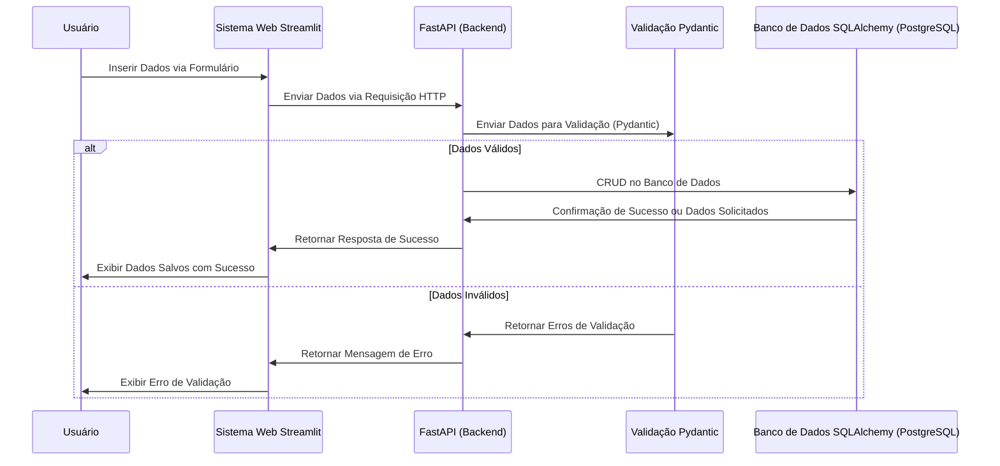

# CRUD Project API
[](https://jownao.github.io/crudProjectAPI/)

## Introdução
Este projeto é um sistema de CRUD (Create, Read, Update, Delete) desenvolvido com uma arquitetura robusta utilizando várias ferramentas modernas, com o objetivo de criar uma aplicação eficiente e escalável para gestão de dados em um banco de dados **PostgreSQL**. O frontend é implementado com **Streamlit**, enquanto o backend utiliza **FastAPI** para manipulação de dados com **SQLAlchemy** como ORM e **Pydantic** para validação de dados. 

O projeto está todo containerizado com **Docker**, facilitando o processo de desenvolvimento e deploy. Além disso, o código é mantido em conformidade com as boas práticas de desenvolvimento utilizando **Ruff** para análise estática de código.

  



---

### Demonstração
Veja o projeto em ação através do vídeo de demonstração no YouTube:  
🔗 [Demonstração do projeto](https://youtu.be/8HLwC8Y_jNw)

**Capturas de Tela:**  
  
  
  
  
  

---

## Documentação 📄
A documentação completa do projeto, incluindo todas as rotas e instruções de uso, está disponível no link abaixo:  
🔗 [Documentação da API](https://jownao.github.io/crudProjectAPI/)

---

## Funcionalidades 🛠️
- **CRUD Completo**: Gerenciamento de dados com as operações de criação, leitura, atualização e exclusão.
- **Validação de Dados**: Validação robusta com **Pydantic**.
- **Interface Web**: Frontend interativo com **Streamlit**, permitindo interações simples e rápidas.
- **Backend**: Utilização do **FastAPI** para um backend rápido, eficiente e escalável.
- **Persistência de Dados**: Uso de **PostgreSQL** como banco de dados relacional, com **SQLAlchemy** como ORM.
- **Dockerizado**: Ambiente de desenvolvimento configurado com **Docker**, facilitando a replicação e execução do projeto em qualquer máquina.
- **Código Limpo**: Uso de **Ruff** para manter a qualidade do código, identificando problemas de estilo e bugs potenciais.

---

## Estrutura do Projeto 📂
A estrutura do projeto é organizada da seguinte forma:


```plaintext
📦 crudProject
│
├── 📁 backend          # Código fonte do backend
│   ├── .dockerignore   # Arquivo Docker ignore
│   ├── Dockerfile      # Dockerfile para criar a imagem do backend
│   ├── crud.py         # Operações CRUD
│   ├── database.py     # Configurações do banco de dados
│   ├── main.py         # Ponto de entrada da aplicação (FastAPI)
│   ├── models.py       # Modelos de dados (SQLAlchemy)
│   ├── requirements.txt# Dependências do backend
│   ├── router.py       # Definição de rotas
│   └── schemas.py      # Esquemas de validação de dados (Pydantic)
│
├── 📁 docs             # Configurações e arquivos de documentação (MkDocs)
│
├── 📁 frontend         # Código do frontend (Streamlit)
│   ├── .dockerignore   # Arquivo Docker ignore
│   ├── Dockerfile      # Dockerfile para criar a imagem do frontend
│   ├── app.py          # Script do Streamlit para a interface
│   ├── logo.png        # Logo do frontend
│   └── requirements.txt# Dependências do frontend
│
├── 📁 site             # Arquivos de configuração do site(MkDocs)
│   ├── .gitignore      # Arquivo Git ignore
│   ├── .python-version # Versão do Python
│   ├── README.md       # Arquivo README
│   ├── docker-compose.yml # Arquivo para orquestrar os serviços (PostgreSQL, FastAPI, etc.)
│   ├── mkdocs.yml      # Configuração do MkDocs
│   ├── pyproject.toml  # Configurações do projeto Python
│   ├── requirements.txt# Dependências com pip
│   └── uv.lock         # Dependências com UV
```

---

## Requisitos 🔧
Para rodar o projeto localmente, você precisará de:

- **Docker** (e Docker Compose)
- **Python 3.9+**
- **PostgreSQL**
- **Ferramentas listadas**: Streamlit, Pydantic, FastAPI, SQLAlchemy, MkDocs, Ruff

---

## Instalação 🛠️

Siga os passos abaixo para configurar o ambiente localmente:

1. **Clone o repositório**
   ```bash
   git clone https://github.com/seu-usuario/crudProject.git
   cd crudProject
   ```

2. **Instale as dependências**
   Caso prefira usar um ambiente virtual com **UV**:
   ```bash
   uv --sync
   ```

3. **Suba os containers com Docker**
   Certifique-se de ter o **Docker** e **Docker Compose** instalados. Depois, execute:
   ```bash
   docker-compose up --build
   ```

4. **Acesse a aplicação**
   - **Frontend (Streamlit)**: Acesse `http://localhost:8501` no navegador.
   - **Backend (FastAPI)**: A documentação interativa da API estará disponível em `http://localhost:8000/docs`.

